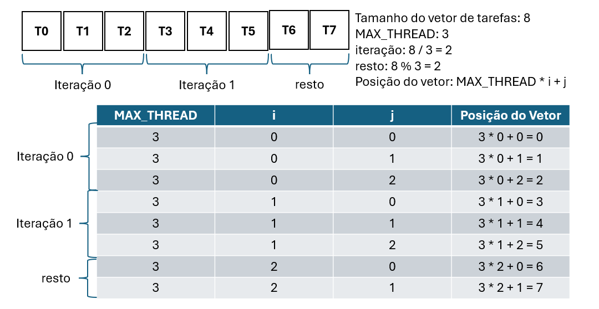

# 06-java-thread

 

```bash
javac *.java
```

```bash
java Main
```
---

# Exercícios

## Exercício 1: Contabilização de Tarefas Executadas
**Objetivo:** alterar o exemplo para contar e exibir quantas tarefas foram executadas com sucesso.

### Requisitos:
1. Adicionar um atributo `tarefasExecutadas` na classe `Consumidor` para contar as tarefas.
2. Incrementar o contador cada vez que uma tarefa termina (use `join()` com sucesso).
3. Exibir ao final do programa: "Total de tarefas executadas: X".
4. Adicionar também o tempo total de execução em segundos.

### Dica:
- Use `System.currentTimeMillis()` no início e no final do `consumir()`. 
- Implemente um método `getTarefasExecutadas()` para retornar o contador.

### Saída esperada:
```
Tamanho do vetor de tarefas: 8
Número máximo de threads: 3
...
Total de tarefas executadas: 8
Tempo total: 2.5 segundos
FIM DO PROGRAMA!
```

---

## Exercício 2: Pool de Threads Configurável 

**Objetivo:** criar um sistema que permite variar o tamanho do pool de threads.

### Requisitos:
1. Modificar a classe `Consumidor` para aceitar `MAX_THREAD` como parâmetro no construtor.
2. Criar 3 instâncias de consumidor com diferentes tamanhos: 2, 4 e 6 threads.
3. Medir o tempo de execução para cada configuração.
4. Exibir qual configuração foi mais eficiente (menor tempo).

### Estrutura sugerida:
```java
Consumidor consumidor2threads = new Consumidor(2);
Consumidor consumidor4threads = new Consumidor(4);
Consumidor consumidor6threads = new Consumidor(6);
```

### Saída esperada:
```
Teste com 2 threads: 4.2 segundos
Teste com 4 threads: 2.3 segundos
Teste com 6 threads: 2.5 segundos
Configuração mais eficiente: 4 threads (2.3s)
```

---

## Exercício 4: Sistema de Prioridade de Tarefas 
**Objetivo:** criar tarefas com diferentes níveis de prioridade (ALTA, MÉDIA, BAIXA) e executá-las em ordem de prioridade.

### Requisitos:
1. Modificar `Tarefa` para incluir um atributo `prioridade`. Sugestão: usar `enum` (enumeração) de Java.
2. O `Produtor` atribui prioridades aleatoriamente às tarefas.
3. O `Consumidor` ordena as tarefas por prioridade antes de executar.
4. Exibir a prioridade de cada tarefa ao ser executada.
5. Contar quantas tarefas de cada prioridade foram executadas.

### Estrutura sugerida:
```java
public enum Prioridade {
    ALTA(1), MEDIA(2), BAIXA(3);
    private final int valor;
    
    Prioridade(int valor) { 
        this.valor = valor; 
    }
}

public class Tarefa extends Thread {
    private Prioridade prioridade;
    ...
}
```

### Saída esperada:
```
Tarefas geradas:
Tarefa 0 (BAIXA) 
Tarefa 1 (ALTA)
Tarefa 2 (MÉDIA)
...

Executando por prioridade:
Terefa 1 (ALTA) realizada com sucesso.
Terefa 4 (ALTA) realizada com sucesso.
Terefa 2 (MÉDIA) realizada com sucesso.
...

Resumo: 2 ALTA, 3 MÉDIA, 3 BAIXA
```


